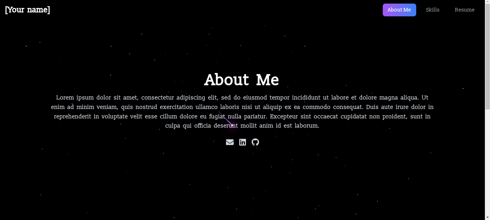

# Starry Night Portfolio Template



This **Next.js** portfolio template forms the base of my personal portfolio, featuring a serene **Starry Night** theme. The background is brought to life with **twinkling stars** and a **shooting star** animation over a black sky. It is customizable and fully responsive, ensuring a great user experience across different devices and screen sizes.

**[View Demo](https://shramana.vercel.app/)**

## Project Structure

```
src/
│
├── components/
│   ├── AboutMe.js           # About Me section component
│   ├── CustomCursor.js      # Custom animated cursor
│   ├── Navigation.js        # Navigation bar for the website
│   ├── ParallaxEffect.js    # Parallax scrolling effect for sections
│   ├── SkillsChart.js       # Skills and Project section component
│   └── TwinklingStars.js    # Background animation of twinkling stars
│
├── pages/
│   ├── _app.js              # Next.js App wrapper
│   └── index.js             # Home page
│
├── styles/
│   └── global.css           # Global CSS styles
│
├── next.config.mjs          # Next.js configuration file
└── tailwind.config.js       # Tailwind CSS configuration file
```

## Getting Started

Follow these steps to set up and run the project locally.

### Prerequisites

Ensure you have the following installed:

- [Node.js](https://nodejs.org/) >= 18.18
- [npm](https://www.npmjs.com/)

### Installation

1. Clone the repository:
   
    ```bash
    git clone https://github.com/shrasinh/starry_night_portfolio_template.git
    cd starry_night_portfolio_template
    ```

3. Install dependencies:
   
    ```bash
    npm install
    ```

4. Start the development server:
   
   ```bash
   npm run dev
   ```

4. Open `http://localhost:3000` in your browser to view the portfolio.

### Building for Production

To build the project for production, run:

   ```bash
   npm run build
   ```

This will create an optimized production build.

To start the production server:

   ```bash
   npm start
   ```
